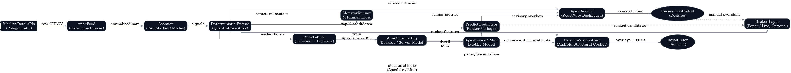

# System Architecture Deep Dive

**Document Classification:** Investor Due Diligence — Technical  
**Version:** 9.0-A  
**Date:** November 2025  

---

## End-to-End Stack Walkthrough

This document provides a narrated walkthrough of the QuantraCore Apex architecture, explaining how data flows through the system and where the major failure boundaries exist.

---

## Ecosystem Overview



The system consists of interconnected components organized in layers:

1. **Data Layer:** Market data ingestion and normalization
2. **Analysis Layer:** Deterministic engine and protocol execution
3. **Learning Layer:** Offline labeling and model training
4. **Advisory Layer:** Predictive ranking and safety gating
5. **Presentation Layer:** UI, APIs, and external interfaces

---

## Data Flow Walkthrough

### Step 1: Market Data Ingestion

```
Market APIs (Polygon, etc.) → ApexFeed → Normalized OHLCV bars
```

**ApexFeed** handles:
- Multi-source data fetching (Polygon.io primary, Alpha Vantage backup)
- OHLCV normalization (consistent schema across sources)
- Gap detection and handling
- Caching for efficiency

**Failure Boundary:** If data source fails, system falls back to cached data or synthetic test data. Never fabricates prices.

---

### Step 2: Universe Scanning

```
Normalized bars → Scanner → Candidate symbols
```

**Scanner** provides:
- 8 scan modes (momentum, breakout, reversal, etc.)
- 7 market cap buckets (nano to mega)
- Configurable filters (liquidity, sector, price range)
- Parallel batch processing

**Failure Boundary:** If scanner fails, returns empty candidate list. Never passes invalid symbols downstream.

---

### Step 3: Deterministic Analysis

```
Candidate symbols → ApexEngine → Structural signals + traces
```

**ApexEngine** executes:
- 80 Tier Protocols (T01-T80): Structural analysis
- 25 Learning Protocols (LP01-LP25): Label generation
- 20 MonsterRunner Protocols (MR01-MR20): Extreme move detection
- 20 Omega Directives (Ω1-Ω20): Safety overrides

**Key Properties:**
- 100% deterministic (hash-verified)
- Full trace logging per decision
- Protocol dependencies resolved in fixed order

**Failure Boundary:** Any protocol failure triggers fail-closed behavior. Signal defaults to AVOID.

---

### Step 4: Label Generation (Offline)

```
Historical data → ApexLab v2 → Labeled datasets
```

**ApexLab v2** generates:
- Window-based features (100-300 bars)
- Teacher labels via engine execution
- Future outcomes (returns, drawdown, runup)
- Quality tiers (A+/A/B/C/D)

**Key Properties:**
- Strictly offline (batch processing)
- No lookahead (future data separated)
- Deterministic labeling

**Failure Boundary:** If labeling fails, dataset generation stops. Never creates partial/corrupt datasets.

---

### Step 5: Model Training (Offline)

```
Labeled datasets → Training → ApexCore v2 models
```

**Training produces:**
- ApexCore v2 Big (desktop, 5-model ensemble)
- ApexCore v2 Mini (mobile, 3-model ensemble)
- Model manifests with SHA256 hashes
- Metrics (AUC, Brier, calibration)

**Failure Boundary:** If training fails or metrics don't meet thresholds, model is not promoted.

---

### Step 6: Predictive Advisory

```
Engine candidates + ApexCore signals → PredictiveAdvisor → Ranked output
```

**PredictiveAdvisor** combines:
- Top-N candidates from deterministic engine
- Model predictions (runner_prob, avoid_trade, etc.)
- Safety gates (disagreement, thresholds)

**Key Properties:**
- Ranker-only (cannot add candidates)
- Engine authority always preserved
- Fail-closed on any issue

**Failure Boundary:** If model unavailable or integrity fails, advisor returns engine-only output.

---

### Step 7: Presentation

```
Ranked output → ApexDesk UI / FastAPI → User
```

**Outputs via:**
- React dashboard (ApexDesk)
- REST API (36 endpoints)
- Proof logs for audit

---

## Hardware Targets

### K6 Desktop (Primary Target)

| Resource | Requirement |
|----------|-------------|
| CPU | Modern multi-core (4+ cores) |
| RAM | 16GB minimum, 32GB recommended |
| Storage | 50GB for data and models |
| GPU | Not required (CPU inference) |

**Suitable for:** Individual researchers, small teams

### Institutional Server

| Resource | Requirement |
|----------|-------------|
| CPU | 16+ cores |
| RAM | 64GB+ |
| Storage | 500GB+ SSD |
| GPU | Optional (for training acceleration) |

**Suitable for:** Production deployments, full-universe scanning

---

## Runtime Component Interaction

### Hot Paths (Real-Time)

| Path | Latency Target | Purpose |
|------|----------------|---------|
| Single scan | <500ms | Interactive analysis |
| API request | <100ms | Dashboard responsiveness |
| Model inference | <50ms | Real-time ranking |

### Batch/Offline Paths

| Path | Duration | Purpose |
|------|----------|---------|
| Full-universe scan | Minutes | End-of-day analysis |
| Lab dataset generation | Hours | Training data creation |
| Model training | Hours | Model refresh |

---

## Failure Boundaries Summary

| Component | Failure Mode | System Response |
|-----------|--------------|-----------------|
| Data source | API unavailable | Fallback to cache/backup |
| Scanner | Processing error | Return empty list |
| Engine | Protocol error | Fail-closed, AVOID signal |
| ApexLab | Labeling error | Stop dataset generation |
| ApexCore | Model integrity fail | Use engine-only output |
| Advisor | Safety gate trigger | Demote or exclude candidate |
| API | Request error | Return error response, log |

---

## Security Boundaries

| Boundary | Protection |
|----------|------------|
| External data | Validated schema, no code execution |
| Model files | SHA256 manifest verification |
| API access | Authentication (when enabled) |
| Execution | Disabled by default, explicit enable |
| Secrets | Environment variables, never in code |

---

## Detailed Technical Documentation

For deeper technical details, see:

- [Engine and Protocols](11_ENGINE_AND_PROTOCOLS.md)
- [ApexLab and ApexCore Models](12_APEXLAB_AND_APEXCORE_MODELS.md)
- [Predictive Layer and Safety](13_PREDICTIVE_LAYER_AND_SAFETY.md)

---

*QuantraCore Apex v9.0-A | Lamont Labs | November 2025*
