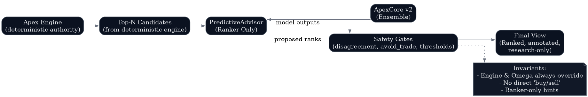

# Predictive Layer and Safety

**Document Classification:** Investor Due Diligence — Technical  
**Version:** 9.0-A  
**Date:** November 2025  

---

## Can This Predictive Layer Blow Up a Fund?

**Short Answer:** No, by design.

The PredictiveAdvisor is architected as a **ranker-only** component with multiple safety gates. It cannot generate trading signals, cannot override the deterministic engine, and fails closed on any issue.

---

## PredictiveAdvisor Architecture



---

## How PredictiveAdvisor Works

### Step 1: Receive Candidates

```
Deterministic Engine → Top-N Candidates → PredictiveAdvisor
```

**Key Constraint:** Advisor can only work with candidates the engine provides. It cannot discover or add new candidates.

### Step 2: Apply Model Signals

```
Candidates → ApexCore v2 → Model predictions
```

For each candidate, ApexCore provides:
- `runner_prob`: Probability of significant move
- `avoid_trade`: Warning probability
- `quality_tier`: Predicted quality
- `regime`: Market regime

### Step 3: Safety Gate Evaluation

```
Model predictions → Safety Gates → Filtered/annotated candidates
```

Safety gates check:
- Ensemble disagreement (high variance = caution)
- Avoid trade threshold (>0.3 = demote)
- Manifest integrity (fail = use engine-only)
- Omega directive status (override if active)

### Step 4: Ranking Output

```
Filtered candidates → Ranked list with annotations
```

Output includes:
- Reordered candidates (by combined score)
- Safety annotations (warnings, demotions)
- Engine-original rankings (preserved)

---

## Fail-Closed Rules

| Condition | Response |
|-----------|----------|
| Model file missing | Use engine-only output |
| Manifest integrity fail | Use engine-only output |
| Ensemble disagreement high | Add caution annotation |
| Avoid trade > threshold | Demote or exclude candidate |
| Omega directive active | Apply directive override |
| Any unexpected error | Use engine-only output |

**Principle:** When in doubt, fall back to the deterministic engine.

---

## Engine Authority Invariants

### Invariant 1: Engine Always Provides Base

The deterministic engine generates the initial candidate list and structural assessments. The advisor cannot modify these base signals — only reorder and annotate.

### Invariant 2: Omega Always Wins

If any Omega directive is active, it overrides both engine and model outputs:

| Directive | Override Behavior |
|-----------|-------------------|
| Ω1 (Safety Lock) | Halt all output |
| Ω2 (Entropy) | Suppress high-volatility signals |
| Ω3 (Drift) | Distrust model, use engine-only |
| Ω4 (Compliance) | Research-only mode (always active) |
| Ω5 (Suppression) | Suppress specific signal types |

### Invariant 3: No Direct Buy/Sell

The system never outputs:
- "BUY XYZ"
- "SELL ABC"
- Trade recommendations

Instead, it outputs:
- "XYZ has QuantraScore 72, runner_prob 0.45, quality B"
- "ABC has avoid_trade 0.38, suggesting caution"
- Ranked lists with structural annotations

---

## Example Scenario

**Input:** Engine provides top-10 candidates for analysis

### Candidate: XYZ

```
Engine signals:
  quantra_score: 78
  quality_tier: A
  runner_prob: 0.65

Model signals:
  pred_runner_prob: 0.72
  pred_avoid_trade: 0.08
  ensemble_disagreement: 0.05

Safety evaluation:
  - disagreement < 0.2 ✓
  - avoid_trade < 0.3 ✓
  - manifest valid ✓

Result: UPRANK (model confirms engine)
```

### Candidate: ABC

```
Engine signals:
  quantra_score: 65
  quality_tier: B
  runner_prob: 0.42

Model signals:
  pred_runner_prob: 0.28
  pred_avoid_trade: 0.45
  ensemble_disagreement: 0.18

Safety evaluation:
  - disagreement < 0.2 ✓
  - avoid_trade > 0.3 ✗

Result: DEMOTE + CAUTION (avoid_trade warning)
```

### Candidate: DEF

```
Engine signals:
  quantra_score: 55
  quality_tier: C
  runner_prob: 0.30

Model signals:
  pred_runner_prob: 0.55
  pred_avoid_trade: 0.12
  ensemble_disagreement: 0.35

Safety evaluation:
  - disagreement > 0.2 ✗

Result: ENGINE-ONLY (high disagreement, distrust model)
```

---

## Disagreement Detection

Ensemble disagreement measures variance across ensemble members:

```
disagreement = std([model_1_pred, model_2_pred, ..., model_N_pred])
```

| Disagreement | Interpretation | Action |
|--------------|----------------|--------|
| < 0.1 | High confidence | Trust model ranking |
| 0.1 - 0.2 | Moderate | Trust with caution |
| > 0.2 | Low confidence | Use engine-only |

---

## Manifest Integrity Verification

Before loading, every model is verified:

```python
def verify_manifest(model_path, manifest):
    actual_hash = compute_file_hash(model_path)
    expected_hash = manifest.hashes["model"]
    
    if actual_hash != expected_hash:
        raise IntegrityError("Model hash mismatch")
    
    if manifest.metrics.val_auc_runner < manifest.thresholds.min_auc:
        raise PromotionError("Metrics below threshold")
```

**On failure:** System uses engine-only output and logs integrity warning.

---

## Research-Only Framing

**Ω4 (Compliance Mode)** is always active, enforcing:

- No execution signals generated
- All outputs labeled as research/educational
- Broker layer disabled by default
- Explicit disclaimers in API responses

---

## Why This Design Is Safe

| Risk | Mitigation |
|------|------------|
| Model hallucination | Engine provides ground truth |
| Overconfident predictions | Disagreement detection |
| Dangerous recommendations | No buy/sell signals |
| System failure | Fail-closed to engine-only |
| Regulatory issues | Ω4 compliance mode |
| Model tampering | SHA256 manifest verification |

---

*QuantraCore Apex v9.0-A | Lamont Labs | November 2025*
