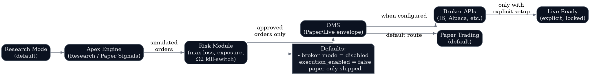

# Broker and Execution Envelope

**Document Classification:** Investor Due Diligence — Technical  
**Version:** 9.0-A  
**Date:** November 2025  

---

## Can This System Trade Live?

**Current Status:** No, by design.

The broker layer is **spec-only** and **disabled by default**. The system ships in research-only mode with execution capabilities intentionally turned off.

---

## Broker Layer Architecture



---

## Default Configuration

```yaml
broker:
  mode: disabled           # Options: disabled, paper, live
  execution_enabled: false # Must be explicitly enabled
  default_route: paper     # Even if enabled, paper is default

risk:
  max_notional: 0          # Zero = no trading allowed
  max_daily_loss: 0        # Zero = no trading allowed
  kill_switch: true        # Ω2 always available

compliance:
  omega_4_active: true     # Research-only mode enforced
```

---

## What Would Be Required for Live Trading

**Important:** This is a description of the architecture, not a recommendation or endorsement of live trading.

### Step 1: Configuration Changes

| Setting | Default | Required for Live |
|---------|---------|-------------------|
| `broker.mode` | `disabled` | `live` |
| `broker.execution_enabled` | `false` | `true` |
| `risk.max_notional` | `0` | `>0` |
| `risk.max_daily_loss` | `0` | `>0` |

### Step 2: Broker API Integration

The system would need:
- API credentials for broker (IB, Alpaca, etc.)
- Order routing implementation
- Position management
- Fill confirmation handling

### Step 3: Regulatory Approvals

Depending on jurisdiction and use case:
- SEC registration (if managing client assets)
- FINRA membership (for broker-dealer activities)
- MiFID II compliance (for EU operations)
- Proper risk disclosures

### Step 4: Additional Risk Controls

Beyond what's implemented:
- Real-time position monitoring
- Margin management
- Corporate action handling
- Disaster recovery procedures

---

## Paper Trading Path

If enabled, paper trading provides:

```
Research signals → Paper OMS → Simulated fills → P&L tracking
```

**Features:**
- Simulated order execution
- Realistic slippage modeling
- P&L calculation and reporting
- No real money at risk

**Use Cases:**
- Strategy validation
- Model performance tracking
- Training and education

---

## Risk Module

The risk module enforces constraints even if execution is enabled:

### Hard Limits

| Limit | Description | Default |
|-------|-------------|---------|
| `max_notional` | Maximum position size | $0 (disabled) |
| `max_daily_loss` | Daily loss limit | $0 (disabled) |
| `max_sector_exposure` | Per-sector limit | 0% (disabled) |
| `max_positions` | Total position count | 0 (disabled) |

### Kill-Switch (Ω2)

The entropy override (Ω2) can halt all execution:

```
Volatility spike → Ω2 triggered → All orders cancelled
```

**Trigger conditions:**
- VIX above threshold
- Portfolio drawdown limit
- Manual override

---

## Safety Invariants

### Invariant 1: Research-Only Default

Ω4 (Compliance Mode) is always active, meaning:
- No execution signals by default
- All outputs labeled as research
- Explicit override required for any trading

### Invariant 2: Paper-Only Shipped

Even if broker mode is enabled, paper is the default route:
- Live execution requires additional explicit configuration
- Fail-safe defaults to paper on any ambiguity

### Invariant 3: Zero Limits Mean Zero Trading

With default limits at zero:
- Any order attempt would be rejected
- Risk module blocks before order reaches broker
- Explicit non-zero limits required

---

## Why Execution Is Disabled

| Reason | Explanation |
|--------|-------------|
| **Regulatory Risk** | Live trading requires proper registration |
| **Liability** | Losses from live trading create liability |
| **Maturity** | System is research-grade, not production-hardened |
| **Focus** | Core value is intelligence, not execution |
| **Safety** | Fail-closed philosophy means disabled by default |

---

## If a Partner Wanted Execution

A serious institutional partner wanting execution would need to:

1. **Add engineering resources** for production hardening
2. **Implement monitoring** for real-time position tracking
3. **Obtain regulatory approval** for their use case
4. **Add disaster recovery** procedures
5. **Accept liability** for trading outcomes

This would be a significant additional development effort beyond the current system.

---

## Honest Assessment

| What Exists | What Doesn't Exist |
|-------------|-------------------|
| Risk module design | Production-ready OMS |
| Paper trading spec | Live broker integration |
| Kill-switch architecture | Real-time monitoring |
| Safety invariants | Regulatory approval |

The broker layer is intentionally minimal because the system's value is in intelligence, not execution.

---

*QuantraCore Apex v9.0-A | Lamont Labs | November 2025*
