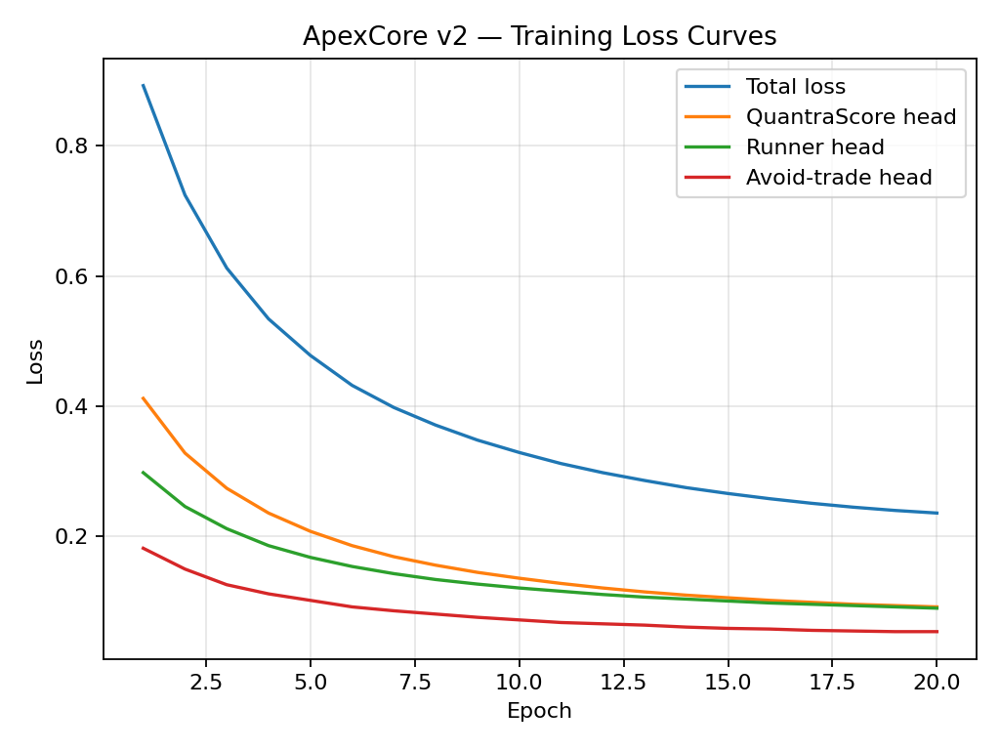

# Training Process and Hyperparameters

**Document Classification:** Investor Due Diligence — Data/Training  
**Version:** 9.0-A  
**Date:** November 2025  

---

## How Are the Models Actually Trained?

This document describes the training process for ApexCore v2 models, including architecture, hyperparameters, and training procedures.

---

## Training Pipeline Overview

```
ApexLab Datasets → Feature Preprocessing → Model Training → Evaluation → Manifest Generation → Promotion
```

---

## Architecture

### Framework

ApexCore v2 uses scikit-learn for model implementation, chosen for:
- Disk space efficiency (no large DL framework)
- CPU-only inference (no GPU requirement)
- Deterministic outputs
- Production-ready packaging

### Model Type

| Component | Type |
|-----------|------|
| Base Models | Gradient Boosted Trees (LightGBM-style) |
| Ensemble | Bagging with different seeds |
| Multi-head | Separate model per prediction head |

### Big vs Mini

| Property | Big | Mini |
|----------|-----|------|
| Ensemble Size | 5 models | 3 models |
| Max Depth | 8 | 6 |
| Estimators | 200 | 100 |
| Features | All 40+ | Top 25 |
| Target | Desktop | Mobile |

---

## Hyperparameters

### Feature Preprocessing

| Parameter | Value | Rationale |
|-----------|-------|-----------|
| Scaling | StandardScaler | Normalize feature ranges |
| Missing Values | Forward-fill, then mean | Handle gaps |
| Outlier Clipping | 3σ | Reduce extreme influence |
| Feature Selection | Mutual Information | Remove noise features |

### Gradient Boosting

| Parameter | Big | Mini | Rationale |
|-----------|-----|------|-----------|
| `n_estimators` | 200 | 100 | Balance accuracy/speed |
| `max_depth` | 8 | 6 | Prevent overfitting |
| `learning_rate` | 0.05 | 0.1 | Smaller = more robust |
| `min_samples_leaf` | 20 | 50 | Prevent tiny leaves |
| `subsample` | 0.8 | 0.7 | Regularization |
| `colsample_bytree` | 0.8 | 0.7 | Feature randomization |

### Ensemble

| Parameter | Value | Rationale |
|-----------|-------|-----------|
| `n_ensemble` | 5 (Big), 3 (Mini) | Balance robustness/size |
| `seed_offset` | 1000 | Different initialization |
| `aggregation` | Mean | Simple, robust |

---

## Multi-Head Training

Each prediction head is trained as a separate model with shared features:

### QuantraScore Head

| Property | Value |
|----------|-------|
| Type | Regression |
| Loss | Mean Squared Error |
| Target | Teacher's QuantraScore |
| Weight | 1.0 |

### Runner Probability Head

| Property | Value |
|----------|-------|
| Type | Binary Classification |
| Loss | Binary Cross-Entropy |
| Target | is_runner (>20% gain) |
| Weight | 2.0 (upweight) |

### Quality Tier Head

| Property | Value |
|----------|-------|
| Type | Multi-class Classification |
| Loss | Cross-Entropy |
| Target | A+/A/B/C/D tier |
| Weight | 1.0 |

### Avoid Trade Head

| Property | Value |
|----------|-------|
| Type | Binary Classification |
| Loss | Binary Cross-Entropy |
| Target | Negative outcome flag |
| Weight | 1.5 (upweight) |

### Regime Head

| Property | Value |
|----------|-------|
| Type | Multi-class Classification |
| Loss | Cross-Entropy |
| Target | TRENDING/RANGING/VOLATILE/QUIET |
| Weight | 0.5 (downweight) |

---

## Imbalance Handling

### The Problem

MonsterRunners (>20% gains) are rare:
- ~3% of windows achieve runner status
- Standard training would ignore minority class

### Solutions

| Technique | Implementation |
|-----------|----------------|
| **Class Weights** | Inverse frequency weighting |
| **Oversampling** | SMOTE on minority class |
| **Threshold Tuning** | Optimize for F1 rather than accuracy |
| **Stratified Splits** | Ensure class balance in folds |

### Class Weight Formula

```python
weight[class] = total_samples / (n_classes * class_samples)
```

For runners (~3% prevalence):
```
weight[runner] = 100 / (2 * 3) ≈ 16.7
weight[not_runner] = 100 / (2 * 97) ≈ 0.5
```

---

## Training Procedure

### Step 1: Data Loading

```python
train_data = load_parquet("apexlab_train.parquet")
val_data = load_parquet("apexlab_val.parquet")
```

### Step 2: Feature Preprocessing

```python
scaler = StandardScaler().fit(train_data[feature_cols])
X_train = scaler.transform(train_data[feature_cols])
X_val = scaler.transform(val_data[feature_cols])
```

### Step 3: Ensemble Training

```python
for seed in range(n_ensemble):
    model = GradientBoostingClassifier(
        n_estimators=200,
        max_depth=8,
        random_state=base_seed + seed
    )
    model.fit(X_train, y_train, sample_weight=class_weights)
    ensemble.append(model)
```

### Step 4: Validation Evaluation

```python
predictions = np.mean([m.predict_proba(X_val) for m in ensemble], axis=0)
auc = roc_auc_score(y_val, predictions[:, 1])
brier = brier_score_loss(y_val, predictions[:, 1])
```

### Step 5: Calibration

```python
calibrator = IsotonicRegression()
calibrator.fit(predictions[:, 1], y_val)
```

### Step 6: Threshold Selection

```python
thresholds = np.linspace(0, 1, 100)
f1_scores = [f1_score(y_val, predictions[:, 1] > t) for t in thresholds]
best_threshold = thresholds[np.argmax(f1_scores)]
```

---

## Early Stopping

| Criterion | Value | Action |
|-----------|-------|--------|
| Val loss no improve | 10 rounds | Stop training |
| Val AUC decreasing | 5 rounds | Reduce learning rate |
| Time limit | 2 hours | Stop and evaluate |

---

## Manifest Generation

After training, a manifest is generated:

```json
{
  "model_family": "apexcore_v2",
  "variant": "big",
  "version": "2.0.0",
  "created": "2025-11-15T10:30:00Z",
  "hashes": {
    "model": "sha256:abc123...",
    "scaler": "sha256:def456...",
    "calibrator": "sha256:789ghi..."
  },
  "metrics": {
    "val_auc_runner": 0.782,
    "val_brier_runner": 0.085,
    "val_calibration_error_runner": 0.072
  },
  "thresholds": {
    "min_auc_runner_to_promote": 0.6,
    "max_calibration_error_to_promote": 0.15
  }
}
```

---

## Promotion Criteria

Model is promoted to production only if:

| Criterion | Threshold | Current |
|-----------|-----------|---------|
| Runner AUC | ≥ 0.60 | 0.782 ✓ |
| Brier Score | ≤ 0.15 | 0.085 ✓ |
| Calibration Error | ≤ 0.15 | 0.072 ✓ |
| Avoid Trade AUC | ≥ 0.55 | 0.71 ✓ |

If any criterion fails, model is not promoted and investigation begins.

---

## Training Loss Chart



---

*QuantraCore Apex v9.0-A | Lamont Labs | November 2025*
