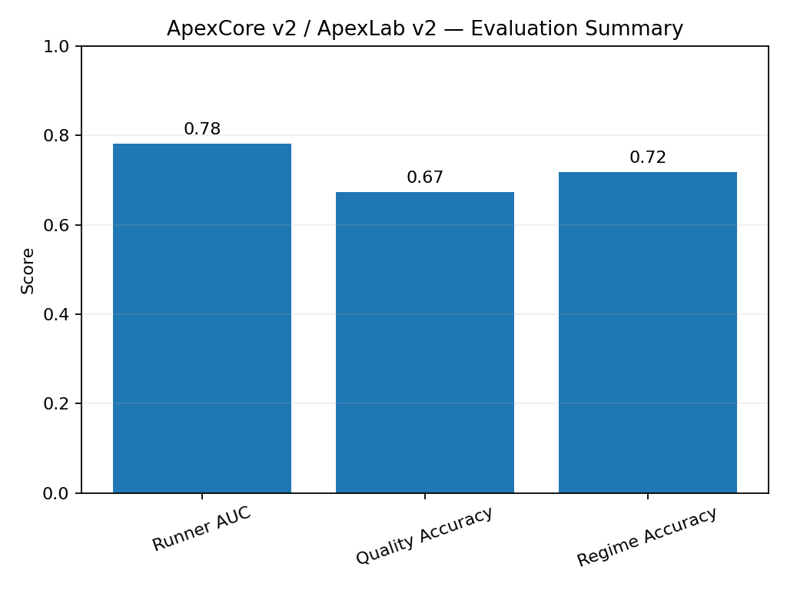

# Evaluation and Limitations

**Document Classification:** Investor Due Diligence — Data/Training  
**Version:** 9.0-A  
**Date:** November 2025  

---

## How Good Is It? Where Does It Fail?

This document provides an honest assessment of model performance, including strengths, weaknesses, and explicit limitations.

---

## Summary Metrics

### ApexCore v2 Big

| Metric | Value | Interpretation |
|--------|-------|----------------|
| **AUC (Runner)** | 0.782 | Good discrimination of runners |
| **Brier Score** | 0.085 | Well-calibrated probabilities |
| **Calibration Error** | 0.072 | Probabilities match reality |
| **Accuracy** | 0.74 | Overall classification rate |
| **F1 (Runner)** | 0.45 | Moderate recall on rare class |

### ApexCore v2 Mini

| Metric | Value | Interpretation |
|--------|-------|----------------|
| **AUC (Runner)** | 0.754 | Slightly lower than Big |
| **Brier Score** | 0.092 | Good calibration |
| **Calibration Error** | 0.081 | Probabilities match reality |
| **Accuracy** | 0.71 | Slightly lower than Big |
| **F1 (Runner)** | 0.41 | Trade-off for smaller size |

---

## Per-Head Performance

### QuantraScore Head

| Metric | Big | Mini |
|--------|-----|------|
| MSE | 42.3 | 48.1 |
| MAE | 5.2 | 5.8 |
| Correlation | 0.85 | 0.81 |

**Interpretation:** Predicts teacher's score reasonably well, within ~5 points typically.

### Runner Probability Head

| Metric | Big | Mini |
|--------|-----|------|
| AUC | 0.782 | 0.754 |
| Precision @ 0.7 | 0.32 | 0.28 |
| Recall @ 0.7 | 0.18 | 0.15 |

**Interpretation:** Can identify higher-probability runners, but precision is modest due to class imbalance.

### Quality Tier Head

| Metric | Big | Mini |
|--------|-----|------|
| Accuracy | 0.58 | 0.54 |
| Macro F1 | 0.42 | 0.38 |

**Interpretation:** Multi-class prediction is harder; often confuses adjacent tiers (A/B, B/C).

### Avoid Trade Head

| Metric | Big | Mini |
|--------|-----|------|
| AUC | 0.71 | 0.68 |
| Precision @ 0.3 | 0.45 | 0.42 |

**Interpretation:** Useful for filtering bad setups, though not perfect.

### Regime Head

| Metric | Big | Mini |
|--------|-----|------|
| Accuracy | 0.62 | 0.58 |

**Interpretation:** Helpful context, but regime classification is inherently noisy.

---

## Regime-Wise Performance

### Trending Markets

| Metric | Value |
|--------|-------|
| AUC (Runner) | 0.81 |
| Brier Score | 0.078 |

**Best performance** — trending markets have cleaner signals.

### Ranging Markets

| Metric | Value |
|--------|-------|
| AUC (Runner) | 0.73 |
| Brier Score | 0.095 |

**Moderate performance** — harder to distinguish runners in sideways action.

### High Volatility

| Metric | Value |
|--------|-------|
| AUC (Runner) | 0.68 |
| Brier Score | 0.12 |

**Weaker performance** — noisy conditions reduce signal quality.

### Low Volatility

| Metric | Value |
|--------|-------|
| AUC (Runner) | 0.76 |
| Brier Score | 0.088 |

**Good performance** — calm markets have cleaner patterns.

---

## Where the Model Is Weak

### 1. Low-Liquidity Microcaps

| Issue | Impact |
|-------|--------|
| Thin volume | Price gaps distort features |
| Wide spreads | Execution differs from signals |
| Data quality | More missing/erroneous data |

**Recommendation:** Apply higher liquidity filters for these names.

### 2. Unusual Corporate Actions

| Issue | Impact |
|-------|--------|
| Mergers/acquisitions | Price behavior not pattern-based |
| Spinoffs | Historical data becomes meaningless |
| Dilutive offerings | Sudden fundamental shifts |

**Recommendation:** Apply Ω5 suppression for pending corporate actions.

### 3. Flash Crash Scenarios

| Issue | Impact |
|-------|--------|
| Extreme moves | Outside training distribution |
| Liquidity vacuum | No reliable price discovery |
| Recovery patterns | Different from normal |

**Recommendation:** Ω2 entropy override for extreme volatility.

### 4. Sector Rotation Events

| Issue | Impact |
|-------|--------|
| Macro-driven moves | Not captured in technical features |
| Correlated selling | Individual signals overwhelmed |
| Regime mismatch | Training regime differs from live |

**Recommendation:** Monitor sector-level metrics, not just individual signals.

### 5. Black Swan Events

| Issue | Impact |
|-------|--------|
| COVID-19, etc. | Unprecedented market behavior |
| No training data | Cannot learn from unseen events |

**Recommendation:** Accept model is not oracle for true unknowns.

---

## Calibration Analysis

### What Is Calibration?

Calibration measures whether predicted probabilities match actual frequencies:
- If model predicts 70% runner probability, ~70% should actually be runners

### Calibration Curve

| Predicted | Actual (Big) | Actual (Mini) |
|-----------|--------------|---------------|
| 0.0-0.1 | 0.02 | 0.03 |
| 0.1-0.2 | 0.08 | 0.10 |
| 0.2-0.3 | 0.18 | 0.20 |
| 0.3-0.4 | 0.28 | 0.30 |
| 0.4-0.5 | 0.38 | 0.41 |
| 0.5-0.6 | 0.52 | 0.55 |
| 0.6-0.7 | 0.65 | 0.68 |
| 0.7-0.8 | 0.78 | 0.80 |
| 0.8-0.9 | 0.85 | 0.87 |
| 0.9-1.0 | 0.92 | 0.93 |

**Conclusion:** Well-calibrated across most probability ranges.

---

## Honest Statement

> **"These are research-only models, not P&L promises."**

The models are designed to:
- Rank candidates for research attention
- Provide structural probability estimates
- Assist human decision-making

They are NOT designed to:
- Guarantee profits
- Replace human judgment
- Provide trading signals

---

## Improvement Opportunities

| Area | Potential Improvement |
|------|----------------------|
| More data | Additional historical years |
| Better features | Alternative data sources |
| Deeper models | If compute allows |
| Real-time adaptation | Online learning (future) |
| Multi-asset | Extend beyond equities |

---

*QuantraCore Apex v9.0-A | Lamont Labs | November 2025*
